## 介绍

此项目是一个 **OJ 系统**，用户可以在此系统中编写代码，提交代码，查看执行结果是否正确。

并集成了**API开放平台**，制作了**SDK**来简化程序员调用API的程序。

共分为四个部分，分别是前端、微服务后端、开放平台SDK、代码沙箱，以下链接分别对应这几个部分：

1. https://github.com/z-h-u-a-i/oj-frontend
2. https://github.com/z-h-u-a-i/oj-backend-microservice
3. https://github.com/z-h-u-a-i/oj-api-client-sdk
4. https://github.com/z-h-u-a-i/oj-code-sandbox


## 架构图

**1）业务架构**

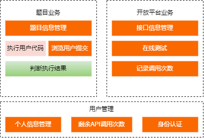 

**2）系统架构**

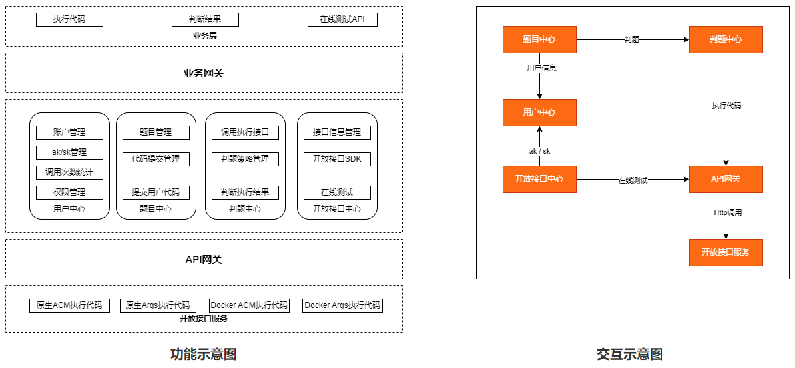                   


## 技术栈

**1）前端** 

- Node.js  16.17.1
- Vue3
- TypeScript
- Arco Design 组件库
- vscode 在线代码编辑组件
- bytedance/bytemd 在线文档组件
- OpenApi 自动生成调用后端接口的方法
    - https://github.com/ferdikoomen/openapi-typescript-codegen

**2）后端** 

- Java 1.8
- Spring Boot 2.6.13
- Spring Boot Starter（SDK开发）
- Spring Cloud Alibaba 2021.0.5.0
- Spring Cloud Gateway
- MySQL 5.7
- Redis 6.0.10
- RabbitMQ 3.8.8
- Nacos 2.2.0
- Seata 1.3.0
- Sentinel Dashboard 1.7.0


## Quick Start

1）将**介绍**中提到的四个部分全部拉到本地

2）逐一安装以上技术栈中需要安装的环境

- 在这提一嘴，Sentinel安装的只是控制台，核心程序在项目引入的Sentinel包中，所以即使不安装Sentinel Dashboard 1.7.0也是可行的。

3）将oj-api-client-sdk项目打成Jar包，存于本地仓库，记得确认一下Maven是否配置的是自己的仓库
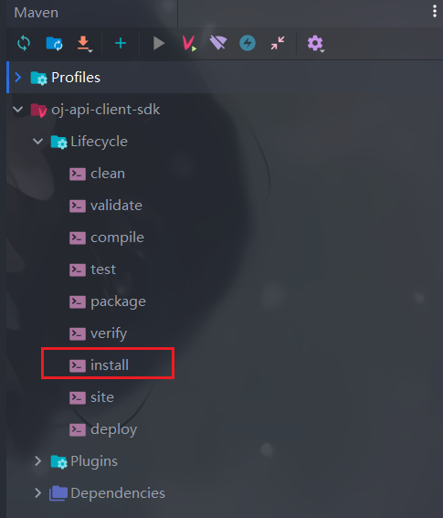
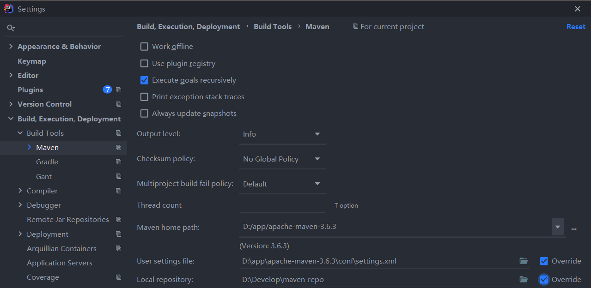

4）`oj-backend-microservice` 项目中，所有**需要启动的微服务模块**复制一份appllication-prod.yaml，命名为appllication-dev.yaml，并在dev中将配置的路径、账号密码改为自己的

- **注意：**prod中是关闭了knife4j文档的，需要手动打开

 

======>

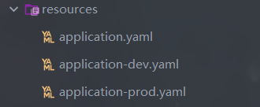 

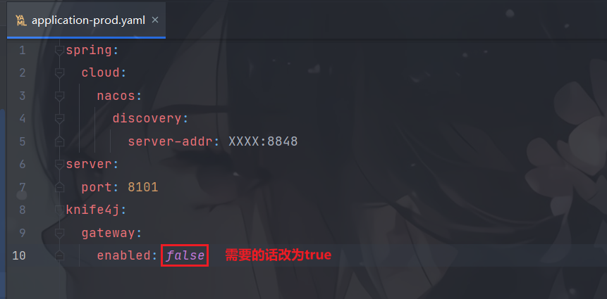

5）`oj-backend-microservice` 项目中，`oj-backend-interface-service` `oj-backend-judge-service`两个模块的`oj.api.client.api-gateway-url`改为`oj-open-api-gateway`模块的启动URL，如果不把他抽象出去的话，直接填`localhost:9000` 即可

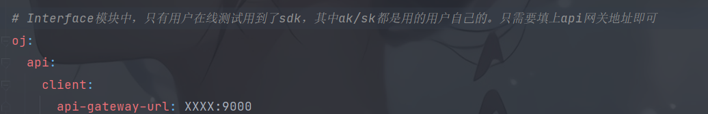 

6）如果修改了后端的接口，需要从新生成OpenAPI后端接口调用代码，改了哪个模块对应哪个代码

```shell
openapi --input http://localhost:8101/api/user/v2/api-docs?group=default  --output ./generated/user --client axios
openapi --input http://localhost:8101/api/question/v2/api-docs?group=default --output ./generated/question --client axios
openapi --input http://localhost:8101/api/interface/v2/api-docs?group=default --output ./generated/interface --client axios
```

接下来修改模块名称/core/OpenApI.ts文件：

1. 取消**BASE**变量的访问地址后缀
2. **WITH_CREDENTIALS**变量改为**true**，

修改后：

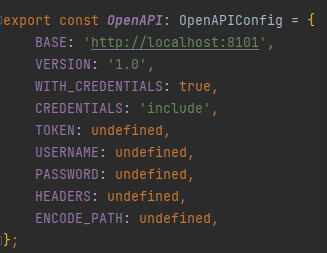 

## 页面展示

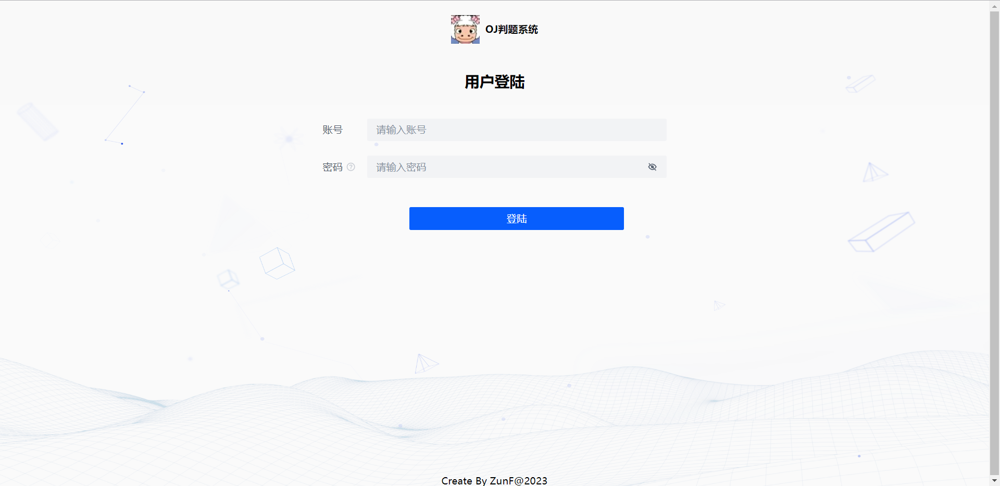

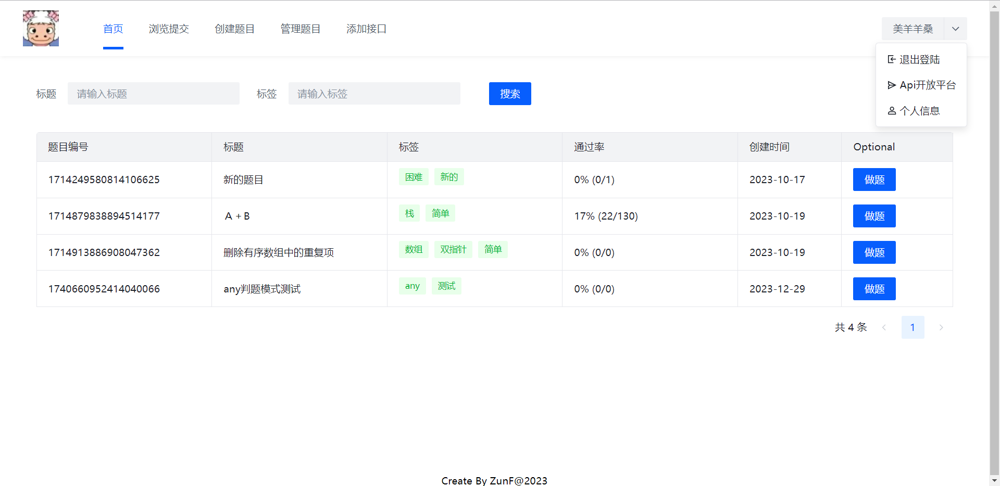

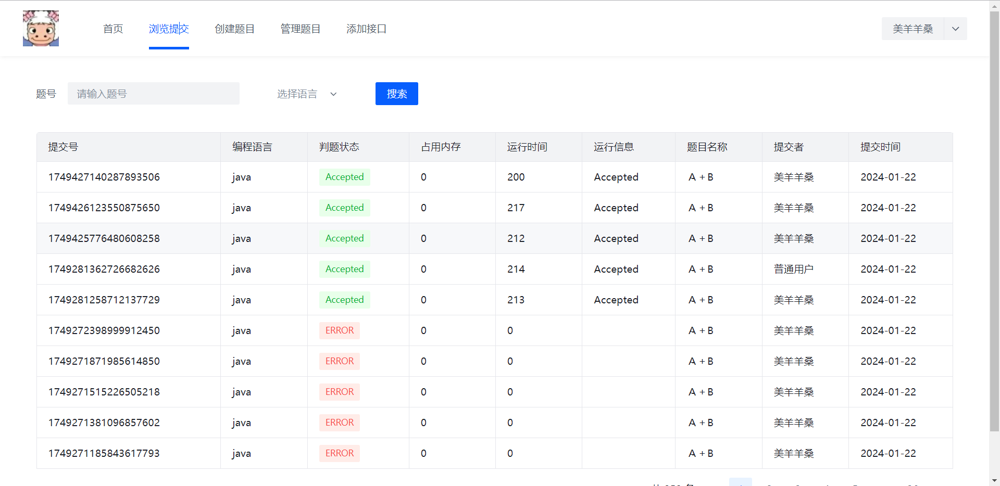


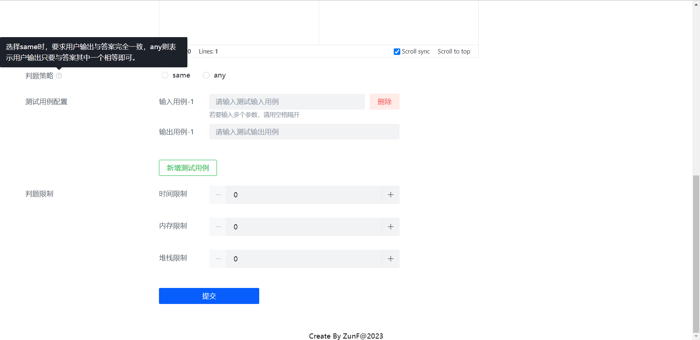

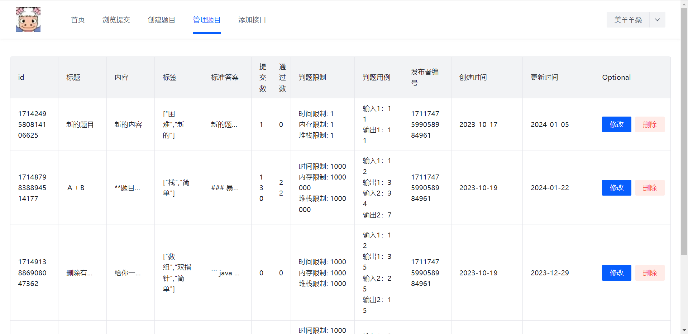

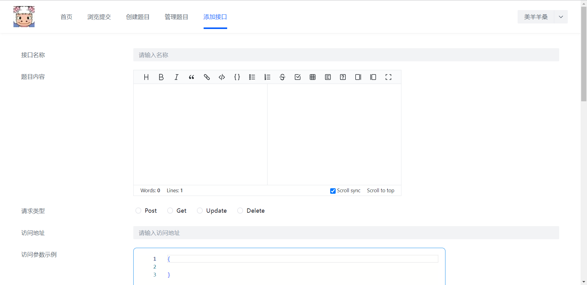


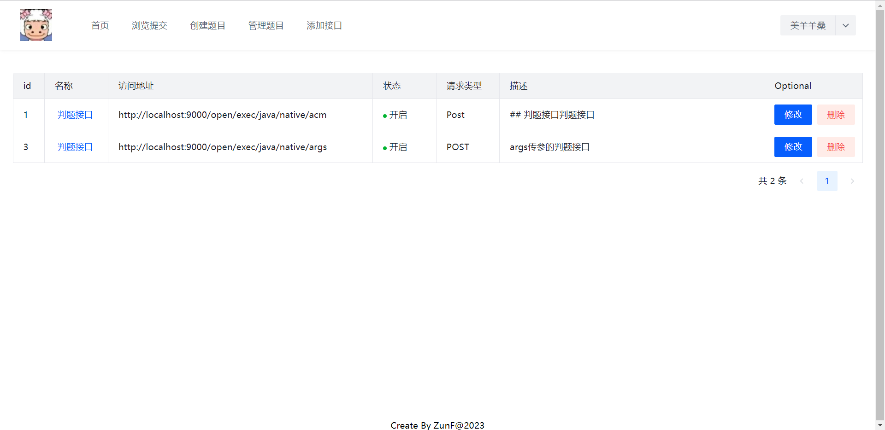

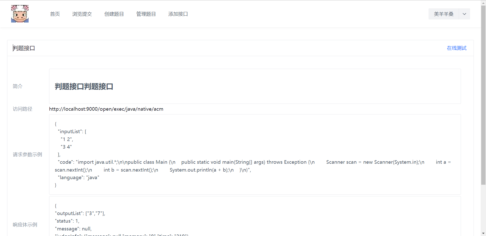

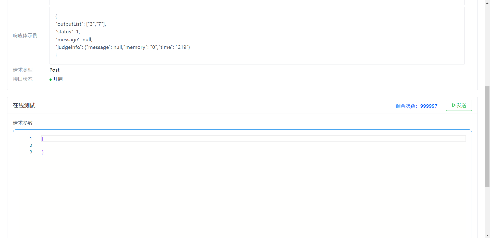
